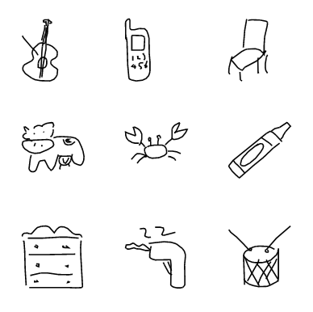
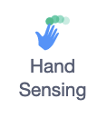
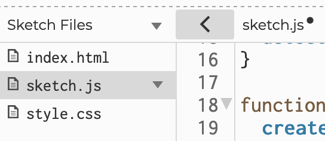

Hoe herkent een computer beeld?

<!--more-->

## 1. Beeldherkenning uitproberen

 Laten we eerst uitproberen wat computers al kunnen herkennen.

Ga naar https://quickdraw.withgoogle.com en klik op 'Let's draw'.
Je ziet nu dikgedrukt wat het spel je vraagt te tekenen. Dat is wel in het Engels. Als je het woord niet kent, vraag je rond wat het betekent. Klik op de groene knop en begin met tekenen. Je hebt 20 seconden om de computer te laten raden wat je tekent!

Hoe kan dat!?

 Deze software kan dus jouw tekeningetjes herkennen! Maar hoe heeft het dat geleerd?

Het 'brein' van deze software is een computerbestand dat gebruikt wordt om patronen te herkennen. We noemen dat een model. Het model is meestal getraind op een heleboel voorbeelden.

In dit geval is het model getraind op 50 miljoen tekeningen van andere mensen.

Als je zes tekeningen gemaakt hebt, zie je je resultaten. Klik maar eens op je tekeningen, dan zie je hoe andere mensen dezelfde dingen tekenden en waar dit model dus van geleerd heeft.

Alle tekeningen zie je hier: https://quickdraw.withgoogle.com/data 

Vind je het ook niet grappig dat de computer nu eens van jou leert, in plaats van andersom?

En heb jij nu een spel gespeeld, of de computer?

## 2. Software opvoeden
Je kunt ook dingen leren aan een computer die echt nog helemaal niks weet.

Open deze pagina om Scratch te leren smileys te herkennen:  
https://scratch.mit.edu/projects/608483569/ 

Maak hem groter met deze knop  en klik op de groene vlag om te beginnen.

Je kunt nu een smiley tekenen, of juist een verdrietig gezichtje, of iets heel anders.

Daarna klik je op 'Done'.

Daarna gaat de software raden wat je getekend hebt. Je ziet bovenaan of hij denkt dat het een smiley is ("is a smiley face") 
of niet ("not a smiley face").

Dan vraagt hij "is het een smiley face?" Als je eerlijk antwoord geeft (met 'yes' of 'no'), dan zal hij steeds beter kunnen raden.

* Kun je hem leren dat een smiley alleen een smiley is als er ook een rondje omheen staat? (Misschien moet je de pagina even sluiten en opnieuw openen om opnieuw te beginnen.)
* Kun je hem ook leren dat alles met een mooie ronde mond een smiley is en verder niks?
* Kun je de software ook verkeerd opvoeden? Dus dat hij denkt dat iets anders een smiley is?

## 3: Face sensing met Scratch

 Tekeningen herkennen is nog maar het begin voor kunstmatige intelligentie.

Je hebt misschien al wel eens Snapchat-filters gebruikt die je er bijvoorbeeld uit laten zien als een kat of zo. Die software heeft dus niet alleen geleerd te herkennen dat er een gezicht in beeld is, maar ook wáár dat gezicht in beeld is, dus bijvoorbeeld waar de neus en de oren zich bevinden.

Dat kun je zelf ook maken, ook weer met Scratch:
https://playground.raise.mit.edu/create/?tutorial=getStarted

Je kunt de taal veranderen in Nederlands als je op het wereldbolletje klikt: 

Kijk eerst even de video onderaan en doe de oefeningen om het poppetje rechts te laten bewegen, te laten praten en geluid te laten maken.

  

### Beeldherkenning met Scratch

Als je het poppetje hebt laten bewegen en een geluidje toegevoegd hebt, dan kun je door naar de beeldherkenning. Klik op dit icoontje linksonderin: 

Klik op 'Hand sensing' om die module toe te voegen. 
Misschien word je dan gevraagd om de browser toestemming geven om je webcam te gebruiken.

Je hebt er nu aan de linkerkant een paar blokken bijgekregen. Dit is wat elke optie betekent:

|                                               |              |
|-----------------------------------------------|--------------|
| go to thumb/index finger/...                  | ga naar duim/wijsvinger/... (je kunt zelfs kiezen welk vingerkootje)|
| turn video on/off/on flipped                  | zet video aan/uit/omgekeerd aan|
| set video transparency to .. transparency     | maak video .. procent doorzichtig|

* Kun je met die blokken het poppetje jouw hand laten volgen? 

### Gezichtsherkenning

Als je Deze functies voor beeldherkenning zijn nog wel in het Engels. Je ziet ze als je linksonderaan klikt op 'Face Sensing'. 

Dit is wat elke optie betekent:

|                                                                                    |              |
|------------------------------------------------------------------------------------|--------------|
|                                   | Ga naar neus |
|  | Wijs in de richting van hoe het gezicht is gekanteld |
|                                     | Maak even groot als de grootte van het gezicht |
|                                      | Als het gezicht naar links is gekanteld |
|                           | Als deze sprite een neus raakt |
|                                   | Als er een gezicht te zien is |
|                                        | is er een gezicht te zien? |
|                                                 | waar het gezicht naartoe is gekanteld |
|                                                 | grootte van het gezicht |

Maak nu met die functies je eigen face filter (net zoals in Snapchat) door sprites je hoofd te laten volgen.

 
 

Een sprite kies je door op door rechtsonderaan op de kat met het plusje te klikken.  
Eventueel kun je Scratch de kat verwijderen.  

  

Als je de sprite hebt aangeklikt die je wil gebruiken, dan kun je beginnen door het blok 'Als er een gezicht te zien is' naar rechts te slepen.

Als je onder besturen kiest voor 'herhaal' en dan 'go to left eye' heb je een sprite die je linkeroog volgt!

  

Eventueel kun je eerst nog even de uitleg over Scratch volgen op https://scratch.mit.edu (dat is dus de versie van Scratch zónder gezichtsherkenning).

Als je een eigen gezichtsfilter hebt gemaakt, kun je natuurlijk nog meer proberen.

Kun je bijvoorbeeld…

* allebei je ogen bedekken door een sprite, misschien elk een andere?
* een geluid afspelen als een gezicht in beeld komt? (zie links onder Geluid)
* een geluid afspelen als het gezicht uit beeld verdwijnt? (Tip: gebruik het blok 'Als .. dan .. anders' onder Besturen en het blok 'a face is detected?')
* Kun je de toonhoogte van het geluid hoger of lager maken afhankelijk van waar je gezicht is? (Tip: gebruik x-positie en y-positie onder Beweging)

Op de pagina waar we net begonnen, https://lab.scratch.mit.edu/face, staan onder het kopje 'Starter Projects' een paar voorbeeldprojecten.

Probeer het Sound Board uit! (Die werkt met je mond.)  
Flapping Bird is ook leuk om te proberen.

## 4. Teachable Machine

Teachable Machine is een ontzettend gave tool van Google. Je kunt er heel snel zelf een model mee trainen om van alles te herkennen. Je kunt drie soorten modellen trainen:

* een model om dingen te herkennen op foto's of video's (beeldherkenning dus)
* een model om geluiden te herkennen in geluidsfragmenten
* een model om bewegingen en houdingen (poses) van je lichaam te herkennen in foto's of op het beeld van je webcam.

  

Om te beginnen ga je naar https://teachablemachine.withgoogle.com 

Klik op 'Get started'.

Je kunt daar kiezen welk model je wil gebruiken. Die om geluiden te herkennen is misschien wat lastig tijdens een 
Coderdojo (te veel geluiden om je heen), maar die andere twee zijn ook allebei gaaf.
Kies de linker als je beeldherkenning wil doen, en de rechter als je de software wil leren houdingen te herkennen.  
(Als je kiest voor beeldherkenning, dan krijg je nog de vraag welk model je wil gebruiken. Kies voor 'Standard image model'.)

We gaan de computer nu leren verschillende beelden te herkennen door hem heel veel voorbeelden te laten zien.  
Klik op 'Webcam' in het blokje 'Class 1'. Je zou nu het beeld van je webcam moeten zien. Stel dat je hem wil leren of een boek in beeld is, hou dan een boek voor de camera en druk op 'Hold to record'.

Hou die knop vast en draai het boek een beetje terwijl je er foto's van maakt. Beweeg hem ook een beetje naar alle hoeken van het beeld, en misschien ook wat dichter naar de camera en verder van de camera af. Op die manier leert het model van alle manieren waarop het boek mogelijk in beeld is. Je moet minstens enkele tientallen foto's hebben.

Nu moet je het model ook nog leren hoe het beeld eruit ziet als er geen boek in beeld is. Klik onder 'Class 2' ook op 'Webcam' en maak een reeks foto's door op 'Hold to record' te drukken.

Als je op de kopjes Class 1 en Class 2 klikt dan kun je de namen veranderen, bijvoorbeeld in 'Wel boek' en 'Geen boek'.

Als je wil kun je het model ook nog meer verschillende dingen leren, zoals bijvoorbeeld het verschil tussen gewoon boek/stripboek, Harry Potter/geen Harry Potter of open boek/dicht boek. Als je dat wil, klik dan op 'Add a class' linksonderaan en maak opnieuw een reeks foto's.

  

Nu kun je Teachable Machine opdracht geven om het model te trainen, op basis van alle foto's die je gemaakt hebt.

Klik op 'Train Model'. Dit duurt wel even een paar minuten.

Het trainen is veel meer werk met al die foto's dan die paar tekeningetjes die we eerder maakten met Scratch.

  

Als hij klaar is met trainen, dan zie je  en rechts in beeld weer je webcam. Daar kun je nu gaan kijken hoe goed het model werkt!

Je ziet onder je webcam hoe zeker het model weet wat er in beeld is, uitgedrukt in een percentage.

Als het niet goed werkt, train het model dan nog een keer met meer foto's of andere foto's.

  

Wij hebben de computer dus níet uitgelegd wat een gezicht ís of hoe hij dat moet herkennen, we hebben hem alleen maar heel veel voorbeelden laten zien. Dát is kunstmatige intelligentie. We noemen dat ook wel machine learning, lerende machines.

  

Extra gaaf is dat je het model dat je getraind hebt kunt exporteren, bijvoorbeeld om het te gebruiken op je eigen website. Klik daarvoor op 'Export Model'. 

  

Klik op 'Download' en dan 'Download my model'. Klik dan op 'p5.js', kopiëer de code in het venster daaronder en sla het op op je computer. Dat kan met een teksteditor of met een programma zoals Visual Studio Code.

 

Eventueel kun je je eigen model gebruiken om een spel of een andere toepassing te programmeren in ML5. Daar gaan we het zo over hebben.

Voordat je daarmee verder gaat, kun je ook eerst het andere model uitproberen dan wat je de eerste keer gekozen hebt!

## 5. ml5

Tot nu toe heb je modellen voor beeldherkenning uitgeprobeerd en zelfs zelf modellen getraind.

Het wordt nóg interessanter als je die getrainde modellen kunt gebruiken in eigen projecten. Dat kan met ml5.js. ml5 is gemaakt om machine learning makkelijk te maken voor mensen die (nog) geen professionele programmeurs zijn.

Open een browser op je computer en ga naar https://editor.p5js.org.

We beginnen met de beelden uit je webcam. Die haal je binnen in dit script met de volgende regels. Zet ze in het voorbeeldscript in de setup-functie, direct onder de regel die begint met createCanvas:


 video = createCapture(VIDEO);
 video.size(400, 400);
 video.hide();


Voeg dan dit toe aan de draw-functie, direct onder de regel die begint met background:



  image(video, 0, 0);



Test maar of dat nu werkt. Als je linksbovenaan in je scherm op de grijze afspeel-knop klikt, dan start het script en zou je je video moeten zien.

  

Dan gaan we nu de beeldherkenning toevoegen. Om te beginnen moeten we ml5 binnenhalen en dat doen we in het bestand index.html. Je komt daar door op het pijltje te klikken naast 'sketch.js', boven het script.

  

Klik in het lijstje dat links verschijnt op index.html. Dat bestand wordt nu rechts geopend. Voeg de volgende regel toe, op een nieuwe regel net boven de regel die begint met '<link rel="stylesheet"':





Ga nu terug naar sketch.js, en zet deze regels helemaal bovenaan in je script:



let video;
let detector;
let detections = [];

function preload() {
 detector = ml5.objectDetector('cocossd');
}

function gotDetections(error, results) {
 if (error) {
        console.error(error);
 }
 detections = results;
 detector.detect(video, gotDetections);
}


Die eerste drie zijn de variabelen die we nodig hebben om op te slaan wat ml5 allemaal herkent. De preload-functie daarna zorgt ervoor dat we ml5 klaarstaat voordat we ermee willen gaan werken.

De functie gotDetections wordt aangeroepen als er objecten gevonden zijn. Dat ml5 dat moet doen zeggen we door deze regel toe te voegen aan de setup-functie:



detector.detect(video, gotDetections);



Tot slot willen we in beeld te zien krijgen welke objecten ml5 herkent en waar ze zijn. Zet daarom in de draw-functie deze for-loop, onder de regel die begint met 'image':



for (let i = 0; i < detections.length; i++) {
   let object = detections[i];
   stroke(0, 255, 0);
   strokeWeight(4);
   noFill();
   rect(object.x, object.y, object.width, object.height);
   noStroke();
   fill(255);
   textSize(24);
   text(object.label, object.x + 10, object.y + 24);
}


Start nu het script, en ontdek welke objecten het model allemaal herkent!

Kun je nu ook…

* alleen één bepaald object laten herkennen? (Tip: gebruik een if-statement en 'object.label')
* Kun je ook alles laten zien behalve personen? (Tip: gebruik een if-statement en een uitroepteken)
* geluiden laten horen als er bepaalde objecten in beeld zijn (bijvoorbeeld een ringtone als een mobiele telefoon te zien is)

Op https://ml5js.org/community/ staan een aantal hele gave voorbeelden van wat je verder allemaal kunt met ml5. 
Misschien kun je een variatie maken op dit geweldige spel? https://pose.yee.gd/ (misschien kun je een beetje afkijken van hun code!)

## Extra voorbeeld 1

Meer zien wat de computer allemaal kan herkennen aan je gezicht, live in de browser:

https://vladmandic.github.io/human/demo/typescript/index.html

(Laden kan even duren. Gebruik Toestaan. Scherm groot maken.)

Tel maar eens alle verschillende kenmerken die de software kan herkennen. Het zijn er heel veel!

## Extra voorbeeld 2

Tof voorbeeld om uit te proberen: https://www.craiyon.com/

Dit is kunstmatige intelligentie, maar dan niet om beelden te herkénnen maar om beelden te generéren.
